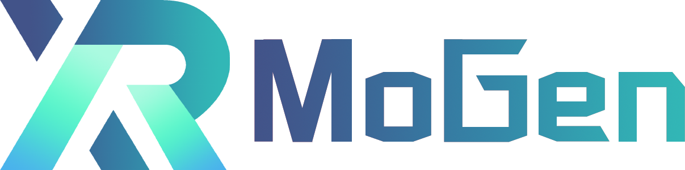

<br/>

<div align="center">
    
</div>

<br/>


## Introduction

English | [简体中文](README_CN.md)

https://user-images.githubusercontent.com/81355712/187817864-37c984a5-032d-492b-8314-493a23c27e5e.mp4

XRMoGen is a codebase for motion generation.
Currently, it contains two dance generation algorithms

- Bailando: Siyao *et al.*, Bailando: 3D Dance Generation by Actor-Critic GPT with Choreographic Memory, CVPR 2022
- DanceRevolution: Huang *et al.*, Dance Revolution: Long-Term Dance Generation with Music via Curriculum Learning, ICLR 2021


 For environment settings, see [installation.md](docs/en/installation.md).


<!-- TOC -->

- [Getting Started](#getting-started)
  - [Datasets](#datasets)
  - [Build a Model](#build-a-model)
    - [Write a new dance generation model](#write-a-new-dance-generation-model)
  - [Train a Model](#train-a-model)
    - [Iteration Controls](#epoch-controls)
    - [Train](#train)
    - [Test](#test)
    - [Visualize](#visualize)
  - [Tutorials](#tutorials)

<!-- TOC -->

## Datasets

We recommend using pre-extracted features for music and motion data, see [dataset_preparation.md](docs/en/dataset_preparation.md).
After downloading, extract it to $PROJECT/data. In order to facilitate the synthesis of a video with music after the dance is generated, it is needed to download the original music (.mov) to the musics folder in the same directory:

```
xrmogen
├── mogen
├── docs
├── configs
├── data
│   ├── aistpp_train_wav
│   ├── aistpp_test_full_wav
│   ├── aistpp_music_feat_7.5fps
│   ├── aist_features_zero_start
│   ├── musics
├── ...
```


## Build a Model


### Write a new dance generation model

The model structure can be customized through config files. To implement a new method, your model need to contain following functions/medhotds to fit the training/test pipeline:


- `train_step()`: forward method of the training mode.
- `val_step()`: forward method of the testing mode.
- registered as a dance model


To be specific, if we want to implement a new model, there are several things to do.

1. create a new file in `mogen/models/dance_models/my_model.py`.

    ```python
    from ..builder import NETWORKS
    from ...builder import DANCE_MODELS

    @DANCE_MODELS.register_module()
    class MyDanceModel(nn.Module):

        def __init__(self, model_config):
            super().__init__()

        def forward(self, ...):
            ....

        def train_step(self, data, optimizer, **kwargs):
            ....

        def val_step(self, data, optimizer=None, **kwargs):
            ....
    ```

2. import the model in `mogen/models/__init__.py`

    ```python
    from .my_model import MyDanceModel
    ```

3. write a config file that defines the model as


    ```python
    model = dict(
        type='MyDanceModel',
        ....
    ```


## Train a Model

### Epoch Controls

XRMoGen uses `mmcv.runner.EpochBasedRunner` to control training and test.

In the training mode, the `max_epochs` in config file decide how many epochs to train.
In test mode, `max_epochs` is forced to change to 1, which represents only 1 epoch to test.

Validation frequency is set as `workflow` of config file:
```python
 workflow = [('train', 20), ('val', 1)]
```

### Train
For example, to train Bailando (Dance Revolution),

```shell
python main.py --config configs/dance_rev.py
```

Arguments are:
- `--config`: config file path.


### Test
To test relevant model, add `--test_only` tag after the config path.
We provide some pretrained weights to test (see [pretrained_model_list.md](docs/en/pretrained_model_list.md). Download the pretrained weights under a folder `./example`, and run

```shell
python main.py --config configs/bailando_test.py --test_only
```
to generate the dance poses.
The poses will be stored under the `workdir` ("./bailando_test" in this case) set in config file.

To Compute the quantitative scores:
```python
python tools/eval_quantitative_scores.py --pkl_root ./bailando_test/test/epoch0 --gt_root data/aist_features_zero_start --music_feature_root data/aistpp_test_full_wav

```

The results should be aligned with [benchmark.md](docs/en/benchmark.md).


### Visualize

```python
python tools/visualize_dance_from_pkl.py --pkl_root ./bailando_test/test/epoch0  --audio_path data/musics/
```


## Tutorials
Currently, we provide some tutorials for users to learn about
* [configs](docs/en/tutorials/config.md)
* [data pipeline](docs/en/tutorials/data_pipeline.md)
* [model](docs/en/tutorials/model.md)

## Other Documents
Except for that，The document also includes the following
* [api](docs/en/api.md)
* [dataset_preparation](docs/en/dataset_preparation.md)
* [installation](docs/en/installation.md)


## License

The license of our codebase is Apache-2.0. Note that this license only applies to code in our library, the dependencies of which are separate and individually licensed. We would like to pay tribute to open-source implementations to which we rely on. Please be aware that using the content of dependencies may affect the license of our codebase. Refer to [LICENSE](LICENSE) to view the full license.


## Citation

If you find this project useful in your research, please consider cite:

```bibtex
@misc{xrmogen,
    title={OpenXRLab Motion Generation Codebase},
    author={XRMoGen Contributors},
    howpublished = {\url{https://github.com/openxrlab/xrmogen}},
    year={2022}
}
```

## Contributing

We appreciate all contributions to improve XRMoGen. Please refer to [CONTRIBUTING.md](.github/CONTRIBUTING.md) for the contributing guideline.


## Acknowledgement

XRMoGen is an open source project that is contributed by researchers and engineers from both the academia and the industry.
We appreciate all the contributors who implement their methods or add new features, as well as users who give valuable feedbacks.
We wish that the framework and benchmark could serve the growing research community by providing a flexible framework to reimplement existing methods and develop their own new models.

## Projects in OpenXRLab

- [XRPrimer](https://github.com/openxrlab/xrprimer): OpenXRLab foundational library for XR-related algorithms.
- [XRSLAM](https://github.com/openxrlab/xrslam): OpenXRLab Visual-inertial SLAM Toolbox and Benchmark.
- [XRSfM](https://github.com/openxrlab/xrsfm): OpenXRLab Structure-from-Motion Toolbox and Benchmark.
- [XRLocalization](https://github.com/openxrlab/xrlocalization): OpenXRLab Visual Localization Toolbox and Server.
- [XRMoCap](https://github.com/openxrlab/xrmocap): OpenXRLab Multi-view Motion Capture Toolbox and Benchmark.
- [XRMoGen](https://github.com/openxrlab/xrmogen): OpenXRLab Human Motion Generation Toolbox and Benchmark.
- [XRNeRF](https://github.com/openxrlab/xrnerf): OpenXRLab Neural Radiance Field (NeRF) Toolbox and Benchmark.
